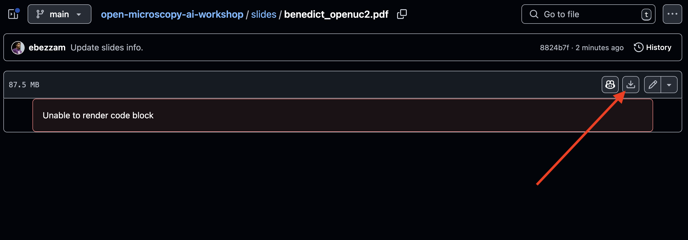
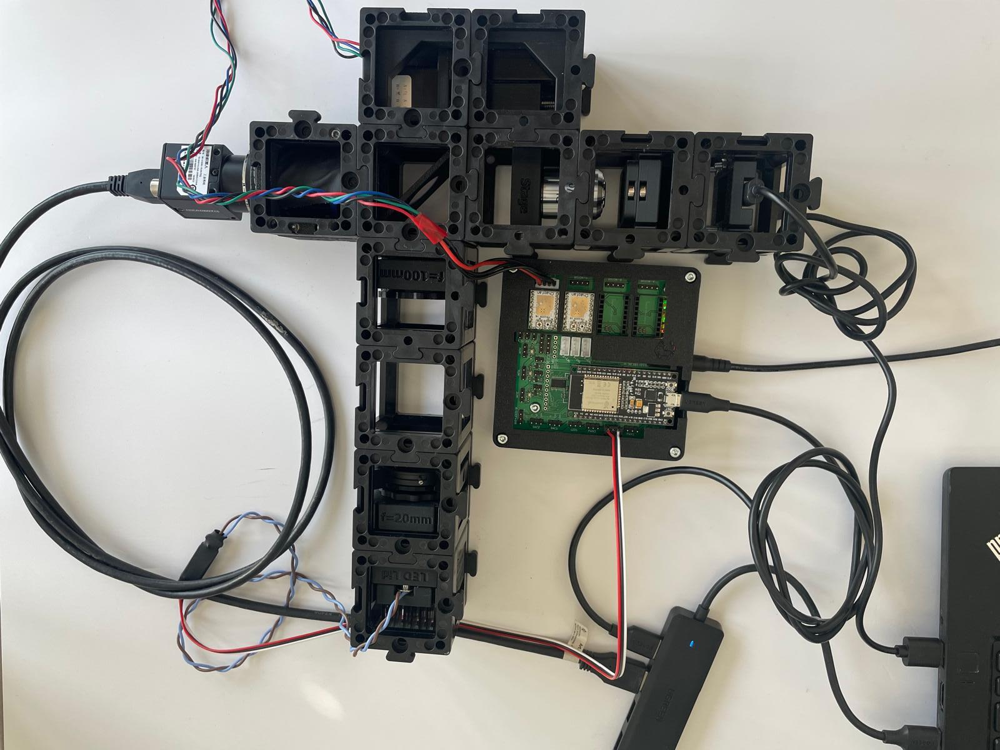

# Open Microscropy and AI Workshop (EPFL, March 14)

In this repository, you will find the materials for the [Open Microscopy and AI Workshop](https://www.epfl-open-microscopy.com/) that took place at EPFL on March 14.

Content:
- [Slides (Morning talks)](#slides-morning-talks)
- [Build our own microscope with OpenUC2](#build-our-own-microscope-with-openuc2)
- [Build your deconvolution algorithm with Pyxu](#build-your-deconvolution-algorithm-with-pyxu)
- [Build your deep-learning analysis pipeline with deepImageJ & SAMJ](#build-your-deep-learning-analysis-pipeline-with-deepimagej--samj)

## Slides (Morning talks)

- Prof. Suliana Manley (EPFL, Laboratory of Experimental Biophysics) - [Smart Microscopy (coming soon!)]()
- Dr. Benedict Diederich (openUC2) - [OpenUC2: Open-Science Modular Microscopy](slides/benedict_openuc2.pdf)
- Dr. Marcos Penedo (EPFL, Laboratory for Bio- and Nano-Instrumentation) - [OpenSPM: A Modular Framework for Smart and Adaptive Microscopy](slides/Marcos_Penedo_OpenSPM_2025.pdf)
- Dr. Sepand Kashani (EPFL, Center of Imaging) - [Pyxu: A Modular Approach to Imaging Across Domains and Scales](slides/sepand_pyxu.pdf)
- Dr. Caterina Fuster-Barceló (UC3Madrid, Bioengineering Department) - [Transforming Bioimage Analysis: The AI4Life Approach](https://zenodo.org/records/15023685)

You can download the slides by clicking the buttom shown below.




## Build our own microscope with OpenUC2

We will build two setups:

- One with your [smartphone](https://openuc2.github.io/docs/Toolboxes/DiscoveryCore/ENGLISH/coreMicroscope/#tutorial-smartphone-microscope)!
- A smart(er) [fluorescence microscope](https://openuc2.github.io/docs/Toolboxes/DiscoveryFluorescence/LED_Fluoresence_microscope) that can controlled by a Raspberry Pi and can be accessed remotely.


### 0) Smartphone Microscope

Let's start with [this tutorial](https://openuc2.github.io/docs/Toolboxes/DiscoveryCore/ENGLISH/coreMicroscope/#tutorial-smartphone-microscope), which does not require any electronics and will get us familiar with building optical setups with openUC2.


If you have any issues, checkout the [troubleshooting page](https://openuc2.github.io/docs/Toolboxes/DiscoveryCore/ENGLISH/coreTroubleshoot/#troubleshooting-and-improving-the-smartphone-microscope).

Next we will build a more advanced microscope for [fluorescence imaging](https://openuc2.github.io/docs/Toolboxes/DiscoveryFluorescence/LED_Fluoresence_microscope) that can be controlled remotely and uses various electronic components (LEDs, motors, cameras). Below we breakdown each step.

### 1) Assembling the Fluorescence Microscope

We can now assemble the microscope! These steps are laid out [here](https://openuc2.github.io/docs/Toolboxes/DiscoveryFluorescence/LED_Fluoresence_microscope/#step-1-assemble-the-microscope).




### 2) Installing the Raspberry Pi

We will be using a Raspberry Pi to control the microscope. We first need to flash (i.e. install) the Raspberry Pi with the software that will allow us to control the microscope. You can follow [these instructions](https://openuc2.github.io/docs/ImSwitch/ImSwitchOnRaspi/#how-to-use-the-pre-built-image) to flash the Raspberry Pi.

After flashing the SD card, insert it into the Raspberry Pi and for a bit for the Raspberry Pi to boot up (green LED should be stable). You should be a new WiFi network called `openuc2-unknown` that you can connect to. The password is `copepode` (or the appropriate network and password).

You can test the connection to ImSwitch for interactive with the microscope, as described [here](https://openuc2.github.io/docs/ImSwitch/ImSwitchOnRaspi/#connecting-to-the-raspberry-pi).

The network provided by the Raspberry Pi won't have internet (if you try going to google.com from your browser, it won't work). But we can connect it to the internet via USB tethering with an Android phone. Connect your Android phone to the Raspberry Pi via USB and enable USB tethering (Settings > Connections > Mobile Hotspot and Tethering, Toggle USB Tethering). Try going to google.com from your browser, it should work now.

### 3) Installing the Electronics

**Caution! If you need to change any of the cables or their position, always unplug the 12V power cable before doing so. Otherwise, the electronic components might get damaged!**

We now need to flash the firmware for:

1. The ESP32 DEV-based UC2 standalone board
2. The LED matrix (if it doesn't work we can skip this component).

These steps are described [here](https://openuc2.github.io/docs/Toolboxes/DiscoveryFluorescence/LED_Fluoresence_microscope/#22-flashing-the-esp32-firmware).

We recommend using Chrome.

### 4) Testing the Electronics

With the electronics connected to **your laptop**, you can test the electronics from [this page](https://youseetoo.github.io/indexWebSerialTest.html):
- Laser 2 for Blue LED
- Motor control, Z stage

To test the camera, [this software](https://openuc2.github.io/docs/Toolboxes/DiscoveryInterferometer/SoftwareTutorial/#install-mvs-app-for-camera-utilization) should be installed on your laptop.

If it all looks good, we can connect the electroncis to the Raspberry Pi.

### 5) Using ImSwitch for remote control

Let's try to control the microscope remotely using ImSwitch. 

- Open a new browser tab and go to [https://192.168.4.1:8001/imswitch/index.html](https://192.168.4.1:8001/imswitch/index.html).
- On the left menu, select UC2, then Configuration Editor, then "Select Setup".
- Load the file `epfl_hik.json` (if you have it) or create a new file (via "Configuration Editor") with the content of [this file](epfl_hik.json).

(Maybe necessary if using an older Raspberry Pi image) Update the Docker configuration with the Raspberry Pi connected to internet:

- From your computer, open a browser and go to [http://192.168.4.1:9090](http://192.168.4.1:9090).
- Login with the username `pi` and password `youseetoo`.
- Open a Terminal from the left menu. 
- Stop the running Docker session by running `docker ps` and `docker stop HASH` (where `HASH` is the hash of the running container).
- Add the file [`epfl_hik.json`](epfl_hik.json) to `ImSwitchConfig/imcontrol_setups/epfl_hik.json`: 
```
vim ImSwitchConfig/imcontrol_setups/epfl_hik.json
```
- Edit `setupFileName` in `ImSwitchConfig/config/imcontrol_options.json` to `epfl_hik.json`:
```
vim ImSwitchConfig/config/imcontrol_options.json
```
- Run `~/Desktop/update_docker_container.sh` and then `~/Desktop/launch_docker_container.sh` to update and launch the Docker container.

---

## Build your deconvolution algorithm with Pyxu

Hands-on tutorial to perform image deconvolution with Pyxu.
Download the `pyxu_deconv.ipynb` notebook in this repository.

You can either:

- run it locally if you have Python 3.10+ installed; or
- run it on [Google Colab](https://colab.research.google.com/drive/13TjiPVKLJXU-ZfwK0OsG0LYckOIj83q2?usp=sharing)

---
## Build your deep-learning analysis pipeline with deepImageJ & SAMJ

See here: https://github.com/deepimagej/Workshop-materials/tree/main/OpenMicroscopyEPFL-2025
